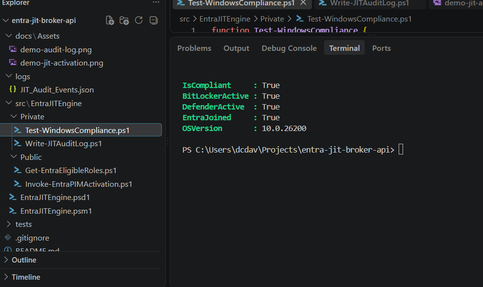
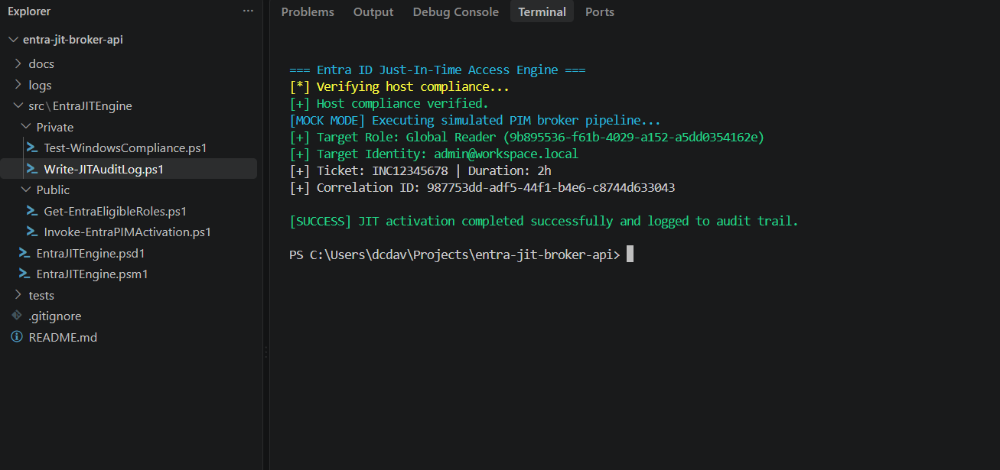
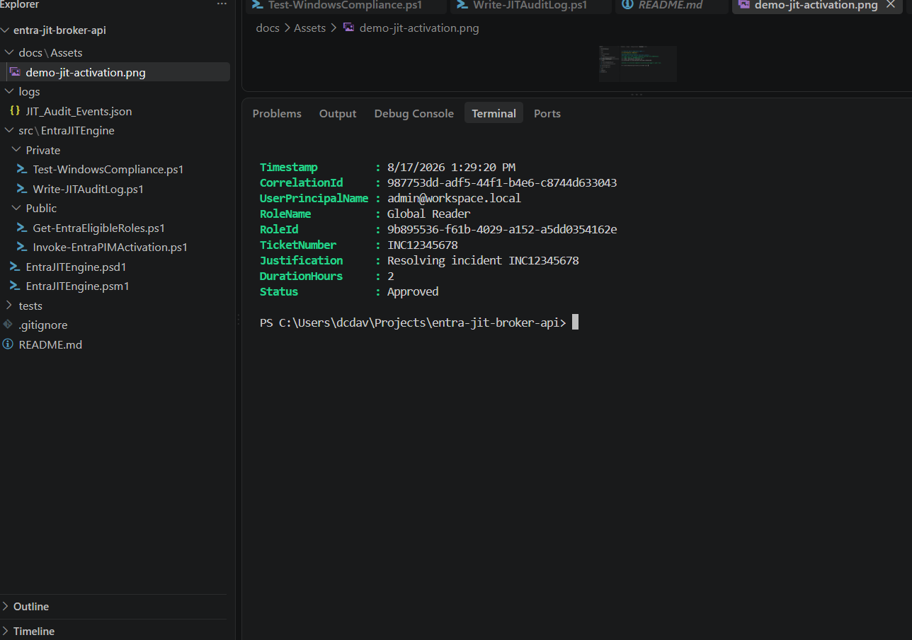

# Entra ID Just In Time Privileged Access Broker

[](https://github.com/PowerShell/PowerShell)
[](#)
[](https://github.com/dcdavisintech/Entra-jit-broker-api/actions)

An enterprise grade PowerShell module engineered around Zero Trust principles to broker Just In Time privileged access via Microsoft Entra ID Privileged Identity Management. The broker enforces preflight host compliance validation, validates ITSM incident justification, manages time bounded role elevation, and emits structured SIEM ready audit records.

## Zero Trust Architecture and Pipeline

```
[ Operator Request ]
         │
         ▼
[ Host Posture Check: Test Windows Compliance ] ─────► [ Access Denied if Non Compliant ]
         │ (Compliant)
         ▼
[ Entra ID PIM Broker / Microsoft Graph API ]
         │
         ▼
[ Structured SIEM Event Sink: JIT Audit Events JSON ]
```

• Preflight Posture Validation: Enforces device trust including BitLocker disk encryption, Windows Defender real time engine, and Entra ID device join before broker authorization.

• Granular PIM Elevation: Executes time bound role activations against Graph API endpoints.

• Resilient Defensive Mode: Includes integrated mock simulation for non production environments, offline validation, and CI CD validation.

• Structured Audit Logging: Writes standardized immutable JSON records equipped with unique correlation IDs for Microsoft Sentinel and Splunk ingestion.

## Visual Demonstrations

### 1. Preflight Host Security Evaluation
Evaluates local security posture before any elevation requests are processed:



### 2. JIT Role Elevation Workflow
Verifies compliance, binds ticket justification, and invokes mock elevation:



### 3. SIEM Ready Audit Record
Generates correlation tracked event logs ready for direct SIEM ingestion:



## Project Structure

```text
entra jit broker api
├── .github
│   └── workflows
│       └── ci.yml
├── docs
│   └── Assets
├── logs
│   └── JIT_Audit_Events.json
├── src
│   └── EntraJITEngine
│       ├── Private
│       │   ├── Test-WindowsCompliance.ps1
│       │   └── Write-JITAuditLog.ps1
│       ├── Public
│       │   ├── Get-EntraEligibleRoles.ps1
│       │   └── Invoke-EntraPIMActivation.ps1
│       ├── EntraJITEngine.psd1
│       └── EntraJITEngine.psm1
├── tests
│   └── EntraJITEngine.Tests.ps1
└── README.md
```

## Quick Start

### 1. Import Module
```powershell
Import-Module .\src\EntraJITEngine\EntraJITEngine.psd1 -Force
```

### 2. Discover Eligible Roles
```powershell
Get-EntraEligibleRoles -Mock
```

### 3. Request JIT Elevation
```powershell
Invoke-EntraPIMActivation `
    -RoleDisplayName "Global Reader" `
    -Justification "Resolving incident INC12345678" `
    -TicketNumber "INC12345678" `
    -DurationHours 2 `
    -Mock
```

### 4. Query SIEM Audit Trail
```powershell
Get-Content .\logs\JIT_Audit_Events.json | ConvertFrom-Json | Select-Object -Last 1 | Format-List
```
